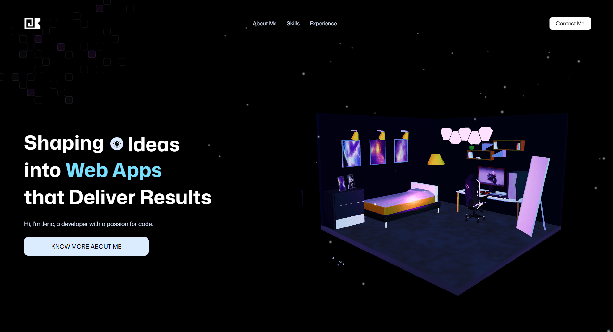

<div align="center">
  
  <h1>JK Portfolio 3D</h1>
  <p>A personal developer portfolio built with <strong>Angular 20</strong> and <strong>Three.js</strong> (via angular-three), featuring an interactive 3D hero scene, animated sections, and a contact form — deployed on Netlify.</p>

[](https://jkalombro3d.netlify.app/)

</div>

---

## Tech Stack

| Layer            | Technology                                     |
| ---------------- | ---------------------------------------------- |
| Framework        | Angular 20 (standalone components, OnPush)     |
| State Management | NgRx 19 (Actions / Reducers / Effects)         |
| 3D Rendering     | Three.js + angular-three + @angular-three/soba |
| Animations       | GSAP 3                                         |
| Styling          | SCSS with design token architecture            |
| Email            | EmailJS                                        |
| Testing          | Jest 30 + Angular Testing Library              |
| Linting          | ESLint + @angular-eslint + Prettier            |
| Deployment       | Netlify                                        |

---

## Project Structure

```
.
├── UI/                         — Angular application
│   └── src/app/
│       ├── home/               — Single-page layout with all sections
│       │   └── components/
│       │       ├── navbar/
│       │       ├── hero/       — 3D room scene (Three.js)
│       │       ├── feature-cards/  — About Me / abilities
│       │       ├── tech-stack/ — Animated 3D tech icons
│       │       ├── experience/ — Work history timeline
│       │       ├── contact/    — EmailJS contact form
│       │       └── footer/
│       └── shared/             — Constants, models, interceptors, helpers
├── specs/                      — Feature specs
├── netlify.toml                — Netlify build config
└── CLAUDE.md                   — Project constitution + coding standards
```

---

## Sections

- **Hero** — Animated headline with a word-cycling slot, 3D room model, and a scrolling animated counter
- **About Me** — Feature cards highlighting key abilities (critical thinking, communication, learning)
- **Skills** — 3D rotating tech stack icons (React, Angular, C#, Node.js, Claude Spec)
- **Experience** — Timeline of work history with roles and responsibilities
- **Contact** — Reactive form with EmailJS integration and field validations
- **Footer** — Version display

---

## Getting Started

```bash
cd UI
npm install
npm start        # dev server at http://localhost:4200
npm test         # Jest with coverage
npm run build    # production build → dist/jk-portfolio/browser
```

---

## Versioning

Format: `MAJOR.MINOR.BUILD`

### v1.0.2 — Current

- Visual polish pass across all sections
- Email form field validations
- Timeline section improvements

### v1.0.1

- Mobile responsiveness fixes
- Animated counter finalized
- Constitution and code quality alignment

### v1.0.0

- Initial versioned release
- Full single-page layout: Navbar → Hero → Feature Cards → Tech Stack → Experience → Contact → Footer
- 3D hero room scene with angular-three
- 3D tech stack icons with GSAP animations
- Work experience timeline
- EmailJS contact form
- Netlify deployment with SPA redirect rules

---

## Constitution

Coding standards, folder conventions, and architectural decisions are documented in [CLAUDE.md](CLAUDE.md) and `.specify/memory/constitution.md`.
